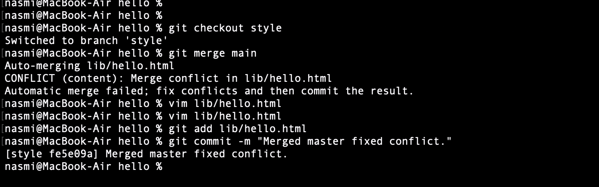

---
## Front matter
title: "Отчёт по лабораторной работе №1"
subtitle: "Дисциплина: Математическое моделирование"
author: "Мишина Анастасия Алексеевна"

## Generic options
lang: ru-RU
toc-title: "Содержание"

## Bibliography
bibliography: bib/cite.bib
csl: pandoc/csl/gost-r-7-0-5-2008-numeric.csl

## Pdf output format
toc: true # Table of contents
toc-depth: 2
lof: true # List of figures
lot: true # List of tables
fontsize: 14pt
linestretch: 1.5
papersize: a4
documentclass: scrreprt
## I18n polyglossia
polyglossia-lang:
  name: russian
  options:
	- spelling=modern
	- babelshorthands=true
polyglossia-otherlangs:
  name: english
## I18n babel
babel-lang: russian
babel-otherlangs: english
## Fonts
mainfont: PT Serif
romanfont: PT Serif
sansfont: PT Sans
monofont: PT Mono
mainfontoptions: Ligatures=TeX
romanfontoptions: Ligatures=TeX
sansfontoptions: Ligatures=TeX,Scale=MatchLowercase
monofontoptions: Scale=MatchLowercase,Scale=0.9
## Biblatex
biblatex: true
biblio-style: "gost-numeric"
biblatexoptions:
  - parentracker=true
  - backend=biber
  - hyperref=auto
  - language=auto
  - autolang=other*
  - citestyle=gost-numeric
## Pandoc-crossref LaTeX customization
figureTitle: "Рис."
tableTitle: "Таблица"
listingTitle: "Листинг"
lofTitle: "Список иллюстраций"
lotTitle: "Список таблиц"
lolTitle: "Листинги"
## Misc options
indent: true
header-includes:
  - \usepackage{indentfirst}
  - \usepackage{float} # keep figures where there are in the text
  - \floatplacement{figure}{H} # keep figures where there are in the text
---

# Цель работы

Приобрести практические навыки работы с системой управления версиями Git.

# Теоретическое введение

Git — распределённая система управления версиями. Проект был создан Линусом Торвальдсом для управления разработкой ядра Linux, первая версия выпущена 7 апреля 2005 года; координатор — Дзюн Хамано [@wiki].

# Выполнение лабораторной работы

## Подготовка

Ранее я уже использовала git, поэтому мне не пришлось выполнять установку.
Для начала настроим core.autocrlf с параметрами true и input, чтобы сделать все переводы строк текстовых файлов в главном репозитории одинаковыми, а затем настроим отображение unicode (рис. @fig:001).

{#fig:001 width=70%}

## Создание проекта

Лабораторную работу выполняю в каталоге со своим логином aamishina.

Начнем работу в пустом рабочем каталоге с создания пустого каталога с именем hello, затем войдем в него и создадим там файл с именем hello.html. Запишем в него фразу "Hello world". Создадим git репозиторий из этого каталога, выполнив команду git init. Добавим файл в репозиторий: git add hello.html и git commit -m "Initial Commit". Используем команду git status, чтобы проверить текущее состояние репозитория. Команда проверки состояния сообщает, что коммитить нечего. Это означает, что в репозитории хранится текущее состояние рабочего каталога, и нет никаких изменений, ожидающих записи (рис. @fig:002).

{#fig:002 width=70%}

## Внесение изменений

Добавим кое-какие HTML-теги к нашему приветствию. Изменим содержимое файла hello.html на: <h1>Hello, World!</h1> (рис. @fig:003).

{#fig:003 width=70%}

Проверим состояние рабочего каталога: git status. git знает, что файл hello.html был изменен, но при этом эти изменения еще не зафиксированы в репозитории. Также обратим внимание на то, что сообщение о состоянии дает подсказку о том, что нужно делать дальше.

## Индексация изменений

Теперь выполним команду git, чтобы проиндексировать изменения и проверим состояние: git add hello.html и git status (рис. @fig:004). Изменения файла hello.html были проиндексированы. Это означает, что git теперь знает об изменении, но изменение пока не записано в репозиторий. Следующий коммит будет включать в себя проиндексированные изменения. Сделаем коммит: git commit. Откроется редактор: в первой строке введем комментарий: «Added h1 tag» (рис. @fig:005). Теперь еще раз проверим состояние: git status. Рабочий каталог чистый, можно продолжить работу.

{#fig:004 width=70%}

{#fig:005 width=70%}

Добавим стандартные теги страницы (рис. @fig:006).

{#fig:006 width=70%}

Теперь добавим это изменение в индекс git: git add hello.html (рис. @fig:007). Добавим заголовки HTML (секцию <head>) к странице «Hello, World» (рис. @fig:008). Проверим текущий статус: git status. Обратим внимание на то, что hello.html указан дважды в состоянии. Первое изменение (добавление стандартных тегов) проиндексировано и готово к коммиту. Второе изменение (добавление заголовков HTML) является непроиндексированным. Если бы вы делали коммит сейчас, заголовки не были бы сохранены в репозиторий. Произведем коммит проиндексированного изменения, а затем еще раз проверим состояние: git commit -m "Added standard HTML page tags" и git status. Состояние команды говорит о том, что hello.html имеет незафиксированные изменения, но уже не в буферной зоне. Теперь добавим второе изменение в индекс, а затем проверим состояние с помощью команды git status: git add . и git status. Второе изменение было проиндексировано и готово к коммиту. Сделаем коммит второго изменения: git commit -m "Added HTML header".

{#fig:007 width=70%}

{#fig:008 width=70%}

## История

Получим список произведенных изменений: git log. Посмотрим однострочный формат истории: git log --pretty=oneline (рис. @fig:009).

{#fig:009 width=70%}

Возвращаться назад в историю очень просто. Команда checkout скопирует любой снимок из репозитория в рабочий каталог. Получим хэши предыдущих версий: git log. Изучим данные лога и найдем хэш для первого коммита. Используем этот хэш-код (достаточно первых 7 знаков) в команде: git checkout <hash>. Затем проверим содержимое файла hello.html: cat hello.html. Веремся к последней версии в ветке main: git checkout main и cat hello.html (рис. @fig:010).

{#fig:010 width=70%}

## Создание тегов версий

Давайте назовем текущую версию страницы hello первой (v1). Создаем тег первой версии: git tag v1. Давайте создадим тег для версии, которая идет перед текущей версией и назовем его v1-beta. Переключаемся на предыдущую версию и просмотрим содержимое файла hello.html: git checkout v1^ и cat hello.html. Это версия c тегами <html> и <body>, но еще пока без <head>. Давайте сделаем ее версией v1-beta: git tag v1-beta. Теперь попереключаемся между двумя отмеченными версиями: git checkout v1 и git checkout v1-beta (рис. @fig:011).

{#fig:011 width=70%}

Посмотрим, какие теги доступны, используя команду git tag: git tag. Также посмотрим теги в логе: git log main --all. Можем видеть теги (v1 и v1-beta) в логе вместе с именем ветки (main). Кроме того HEAD показывает коммит, на который вы переключились (на данный момент это v1-beta) (рис. @fig:012).

{#fig:012 width=70%}

## Отмена локальных изменений (до индексации)

Перейдем на последний коммит ветки main: git checkout main (рис. @fig:013). Внесем изменение в файл hello.html в виде нежелательного комментария (рис. @fig:014). Проверим состояние рабочего каталога: git status. Мы видим, что файл hello.html был изменен, но еще не проиндексирован. Используем команду git checkout для переключения версии файла hello.html в репозитории: git checkout hello.html, git status и cat hello.html. Команда git status показывает нам, что не было произведено никаких изменений, не зафиксированных в рабочем каталоге.

{#fig:013 width=70%}

{#fig:014 width=70%}

## Отмена проиндексированных изменений (перед коммитом)

Изменим файл (рис. @fig:015).

{#fig:015 width=70%}

Проиндексируем изменения: git add hello.html. Проверим состояние нежелательного изменения: git status. Состояние показывает, что изменение было проиндексировано и готово к коммиту. Выполним сброс буферной зоны: git reset HEAD hello.html. Команда git reset сбрасывает буферную зону к HEAD. Это очищает буферную зону от изменений, которые мы только что проиндексировали. Команда git reset (по умолчанию) не изменяет рабочий каталог. Поэтому рабочий каталог все еще содержит нежелательный комментарий. Мы можем использовать команду git checkout, чтобы удалить нежелательные изменения в рабочем каталоге. Переключимся на версию коммита: git checkout hello.html и git status. Наш рабочий каталог опять чист (рис. @fig:016).

{#fig:016 width=70%}

## Отмена коммитов

Отменим коммит путем создания нового коммита, отменяющего нежелательные изменения.
Изменим файл hello.html:

```
<html>
  <head>
  </head>
  <body>
<h1>Hello, World!</h1>
    <!-- This is an unwanted but committed change -->
  </body>
</html>
```

Выполним: git add hello.html и git commit -m "Oops, we didn't want this commit" (рис. @fig:017). Сделаем коммит с новыми изменениями, отменяющими предыдущие: git revert HEAD. В редакторе отредактируем коммит-сообщение (рис. @fig:018). Сохраним и закроем файл. Проверим лог: git log.

{#fig:017 width=70%}

{#fig:018 width=70%}

## Удаление коммиттов из ветки

Прежде чем удалить коммиты, давайте отметим последний коммит тегом, чтобы потом можно было его найти: git tag oops. Глядя на историю лога, видим, что коммит с тегом «v1» является коммитом, предшествующим ошибочному коммиту. Давайте сбросим ветку до этой точки. Поскольку ветка имеет тег, мы можем использовать имя тега в команде сброса (если она не имеет тега, мы можем использовать хэш-значение): git reset --hard v1 и git log. Наша ветка main теперь указывает на коммит v1, а коммитов Oops и Revert Oops в ветке уже нет (рис. @fig:019).

{#fig:019 width=70%}

Давайте посмотрим на все коммиты: git log --all (рис. @fig:020). Мы видим, что ошибочные коммиты не исчезли. Они все еще находятся в репозитории.

{#fig:020 width=70%}

## Удаление тега oops

Давайте удалим тег oops его и коммиты, на которые он ссылался, сборщиком мусора: git tag -d oops и git log --all. Тег «oops» больше не будет отображаться в репозитории (рис. @fig:021).

{#fig:021 width=70%}

## Внесение изменений в коммиты

Изменим страницу (рис. @fig:022), а затем сделаем коммит.

{#fig:022 width=70%}

Обновим страницу hello, включив в нее email (рис. @fig:023).

{#fig:023 width=70%}

Изменим предыдущий коммит: git add hello.html и git commit --amend -m "Add an author/email comment". Просмотрим историю: git log (рис. @fig:024). Мы можем увидеть, что оригинальный коммит «автор» заменен коммитом «автор/email».

{#fig:024 width=70%}

## Перемещение файлов

Переместим файл hello.html в каталог lib: mkdir lib, git mv hello.html lib и git status. Сделаем коммит этого перемещения: git commit -m "Moved hello.html to lib" (рис. @fig:025).

{#fig:025 width=70%}

## Подробнее о структуре

Добавим файл index.html в наш репозиторий:

```
<html>
  <body>
<iframe src="lib/hello.html" width="200" height="200" /> </body>
</html>
```

Добавим файл и сделаем коммит: git add index.html и git commit -m "Added index.html" (рис. @fig:026).Теперь при открытии index.html, видим кусок страницы hello в маленьком окошке (рис. @fig:027).

{#fig:026 width=70%}

{#fig:027 width=70%}

## Git внутри: Каталог .git

Выполним: ls -C .git. Это каталог, в котором хранится вся информация git. Выполним: ls -C .git/objects. Видим набор каталогов, имена которых состоят из 2 символов. Имена каталогов являются первыми двумя буквами хэша sha1 объекта, хранящегося в git. Выполним: ls -C .git/objects/01. Смотрим в один из каталогов с именем из 2 букв. Видим файл с именем из 38 символов. Выполним: cat .git/config. Это файл конфигурации, создающийся для каждого конкретного проекта. Записи в этом файле будут перезаписывать записи в файле .gitconfig вашего главного каталога, по крайней мере в рамках этого проекта. Выполним: ls .git/refs, ls .git/refs/heads, ls .git/refs/tags и cat .git/refs/tags/v1. Выполним: cat .git/HEAD. Файл HEAD содержит ссылку на текущую ветку, в данный момент это ветка main (рис. @fig:028).

{#fig:028 width=70%}

## Работа непосредственно с объектами git

Поиск последнего коммита: git log --max-count=1. Вывод последнего коммита с помощью SHA1 хэша: git cat-file -t <hash> и git cat-file -p <hash>. Поиск дерева, используем SHA1 хэш из строки «дерева», из списка выше: git cat-file -p <treehash>. Вывод каталога lib: git cat-file -p <libhash>. Вывод файла hello.html: git cat-file -p <hellohash> (рис. @fig:029).

{#fig:029 width=70%}

## Создание ветки

Создадим ветку «style»: git checkout -b style и git status. Добавим файл стилей style.css: touch lib/style.css, git add lib/style.css и git commit -m "Added css stylesheet" (рис. @fig:030).

{#fig:030 width=70%}

Обновим файл hello.html, чтобы использовать стили style.css (рис. @fig:031).

{#fig:031 width=70%}

Выполним: git add lib/hello.html и git commit -m "Hello uses style.css". Изменим index.html, чтобы он тоже использовал style.css. Выполним: git add index.html и git commit -m "Updated index.html" (рис. @fig:032).

{#fig:032 width=70%}

## Навигация по веткам

Теперь в вашем проекте есть две ветки: git log --all (рис. @fig:033).

{#fig:033 width=70%}

Переключение на ветку main: git checkout main и cat lib/hello.html. Сейчас мы находимся на ветке main. Это заметно по тому, что файл hello.html не использует стили style.css. Вернемся к ветке style: git checkout style и cat lib/hello.html. Содержимое lib/hello.html подтверждает, что мы вернулись на ветку style (рис. @fig:034).

{#fig:034 width=70%}

## Изменения в ветке main

Пока вы меняли ветку style, кто-то решил обновить ветку main. Они добавили файл README.md. Создадим файл README в ветке main: git checkout main. Создадим файл README.md: echo "This is the Hello World example from the git tutorial." > README.md. Сделаем коммит изменений README.md в ветку main: git add README.md и git commit -m "Added README". Используем следующую лог-команду для просмотра веток и их отличий: git log --graph --all (рис. @fig:035).

{#fig:035 width=70%}

## Слияние

Давайте вернемся к ветке style и сольем main с style: git checkout style, git merge main, git log --graph --all (рис. @fig:036).

{#fig:036 width=70%}

## Создание конфликта

Вернемся в main и создадим конфликт. Файл lib/hello.html (рис. @fig:037).

{#fig:037 width=70%}

Выполним: git add lib/hello.html и git commit -m 'Life is great'. Просмотр веток: git log --graph --all. После коммита «Added README» ветка main была объединена с веткой style, но в настоящее время в main есть дополнительный коммит, который не был слит с style. Последнее изменение в main конфликтует с некоторыми изменениями в style (рис. @fig:038).

{#fig:038 width=70%}

## Разрешение конфликтов

Слияние main с веткой style. Теперь вернемся к ветке style и попытаемся объединить ее с новой веткой main: git checkout style, git merge main (рис. @fig:039).

{#fig:039 width=70%}

Откроем lib/hello.html (рис. @fig:040). Первый раздел — версия текущей ветки (style). Второй раздел — версия ветки main.

{#fig:040 width=70%}

Решение конфликта. Внесем изменения в lib/hello.html (рис. @fig:041).

{#fig:041 width=70%}

Сделаем коммит решения конфликта: git add lib/hello.html и git commit -m "Merged main fixed conflict".

## Сброс ветки style

Вернемся на ветке style к точке перед тем, как мы слили ее с веткой main: git checkout style и git log --graph (рис. @fig:042).

{#fig:042 width=70%}

Мы видим, что коммит «Updated index.html» был последним на ветке style перед слиянием. Давайте сбросим ветку style к этому коммиту: git reset --hard <hash>. Поищем лог ветки style. У нас в истории больше нет коммитов слияний: git log --graph --all (рис. @fig:043).

{#fig:043 width=70%}

## Сброс ветки main

Сброс ветки main: git checkout main, git log --graph (рис. @fig:044).

{#fig:044 width=70%}

Коммит «Added README» идет непосредственно перед коммитом конфликтующего интерактивного режима. Мы сбросим ветку main к коммиту «Added README»: git reset --hard <hash> и git log --graph --all (рис. @fig:045).

{#fig:045 width=70%}

## Перебазирование

Мы вернулись в точку до первого слияния и хотим перенести изменения из ветки main в нашу ветку style: git checkout style, git rebase main и git log --graph (рис. @fig:046).

{#fig:046 width=70%}

## Слияние в ветку main

Мы поддерживали соответствие ветки style с веткой main (с помощью rebase), теперь давайте сольем изменения style в ветку main: git checkout main и git merge style (рис. @fig:047). Посмотрим логи. Теперь ветки style и main идентичны.

{#fig:047 width=70%}

## Клонирование репозиториев

Перейдем в рабочий каталог aamishina и сделаем клон репозитория hello:
cd .. pwd ls, git clone hello cloned_hello, ls. Давайте взглянем на клонированный репозиторий: cd cloned_hello, ls. Видим список всех файлов на верхнем уровне оригинального репозитория README.md, index.html и lib. Просмотрим историю репозитория: git log --all. Видим список всех коммитов в новый репозиторий, и он совпадает с историей коммитов в оригинальном репозитории. Единственная разница в названиях веток (рис. @fig:048).

{#fig:048 width=70%}

## Что такое origin?

Выполним: git remote. Видим, что клонированный репозиторий знает об имени по умолчанию удаленного репозитория. Посмотрим более подробную информацию: git remote show origin. Давайте посмотрим на ветки, доступные в нашем клонированном репозитории: git branch. Как видим, в списке только ветка main. Для того, чтобы увидеть все ветки, вводим команду: git branch -a (рис. @fig:049).

{#fig:049 width=70%}

## Изменение оригинального репозитория

Внесем изменения в оригинальный репозиторий hello: cd ../hello. Внесем изменения в файл README.md: This is the Hello World example from the git tutorial. Сделаем коммит: git add README и git commit -m "Changed README in original repo" (рис. @fig:050).

{#fig:050 width=70%}

Теперь в оригинальном репозитории есть более поздние изменения, которых нет в клонированной версии.

Извлечение изменений: cd ../cloned_hello, git fetch, git log --all (рис. @fig:051).

{#fig:051 width=70%}

Сейчас мы находимся в репозитории cloned_hello. На данный момент в репозитории есть все коммиты из оригинального репозитория, но они не интегрированы в локальные ветки клонированного репозитория. Выводом является то, что команда git fetch будет извлекать новые коммиты из удаленного репозитория, но не будет сливать их с вашими наработками в локальных ветках. Проверим README.md, он не изменился (рис. @fig:052).

{#fig:052 width=70%}

## Слияние извлеченных изменений

Сольем извлеченные изменения в локальную ветку main: git merge origin/main. Еще раз проверим файл README.md. Сейчас мы видим изменения (рис. @fig:053).

{#fig:053 width=70%}

## Добавление ветки наблюдения

Добавим локальную ветку, которая отслеживает удаленную ветку: git branch --track style origin/style, git branch -a, git log --max-count=2. Теперь мы можем видеть ветку style в списке веток и логе (рис. @fig:054).

{#fig:054 width=70%}

## Создайте чистый репозиторий

Создадим чистый репозиторий: cd .., git clone --bare hello hello.git, ls hello.git. Сейчас мы находимся в рабочем каталоге. Мы видим, что в репозитории hello.git нет рабочего каталога (рис. @fig:055).

{#fig:055 width=70%}

## Добавление удаленного репозитория

Давайте добавим репозиторий hello.git к нашему оригинальному репозиторию: cd hello и
git remote add shared ../hello.git (рис. @fig:056). Создадим изменения для отправки: файл README.md, сделаем его коммит. Теперь отправим изменения в общий репозиторий: git push shared main. Общим называется репозиторий, получающий отправленные нами изменения.

{#fig:056 width=70%}

## Извлечение общих изменений

Быстро переключаемся в клонированный репозиторий и извлекаем изменения, только что отправленные в общий репозиторий: cd ../cloned_hello. Сейчас мы находимся в репозитории cloned_hello: git remote add shared ../hello.git, git branch --track shared main, git pull shared main, cat README.md (рис. @fig:057).

{#fig:057 width=70%}

# Выводы

В ходе выполнения данной лабораторной работы я приобрела практические навыки работы с системой управления версиями Git.

# Список литературы{.unnumbered}

::: {#refs}
:::