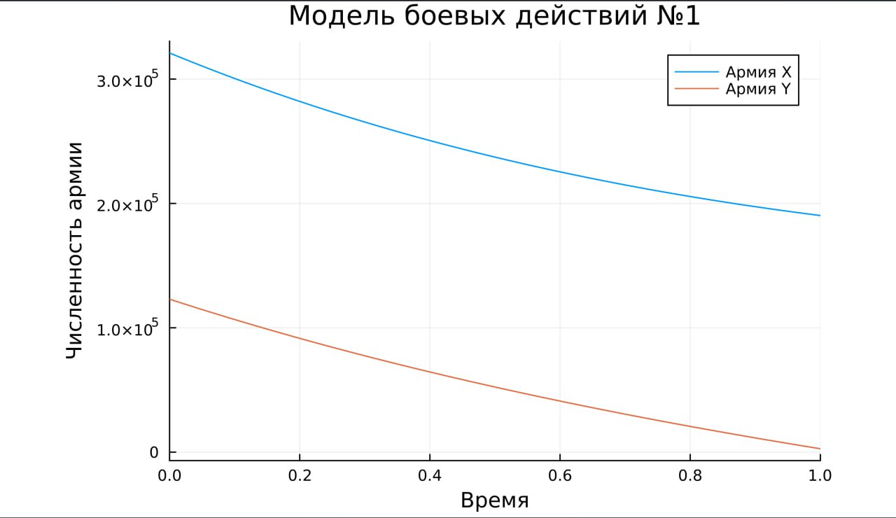
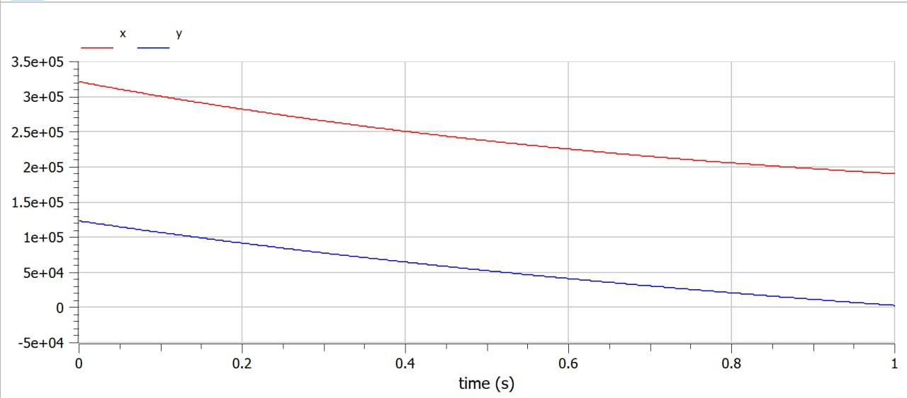
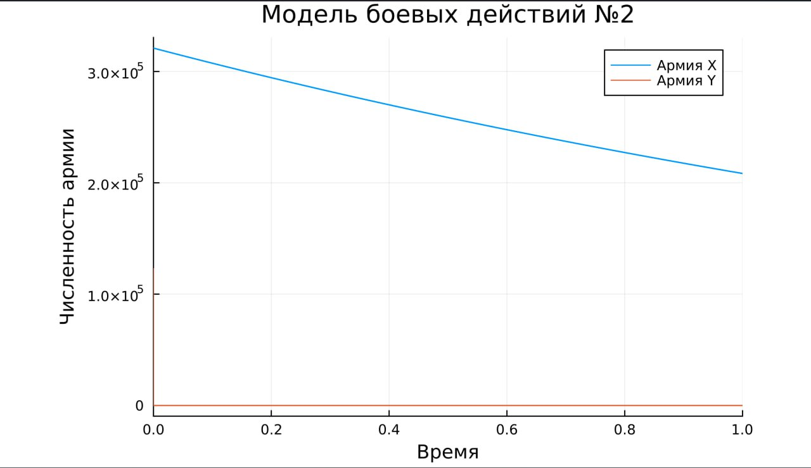
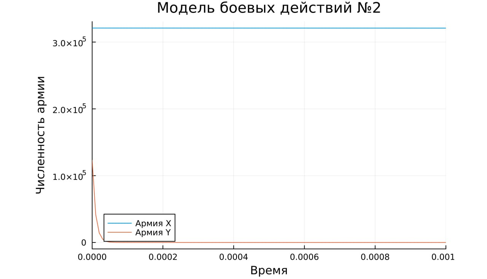
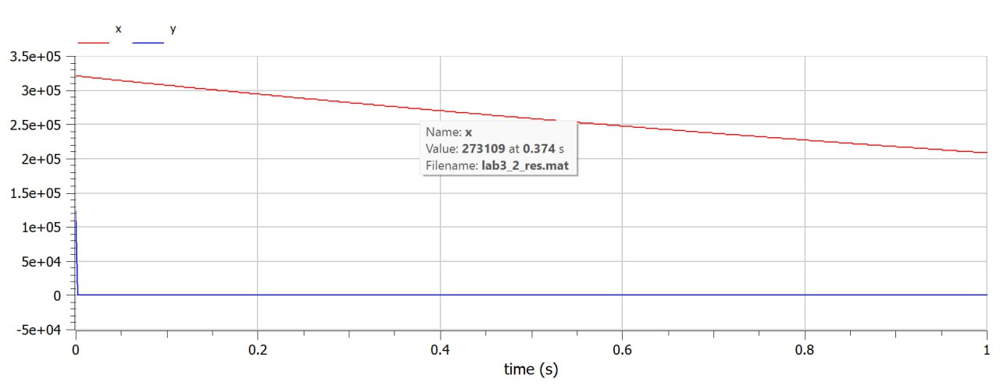
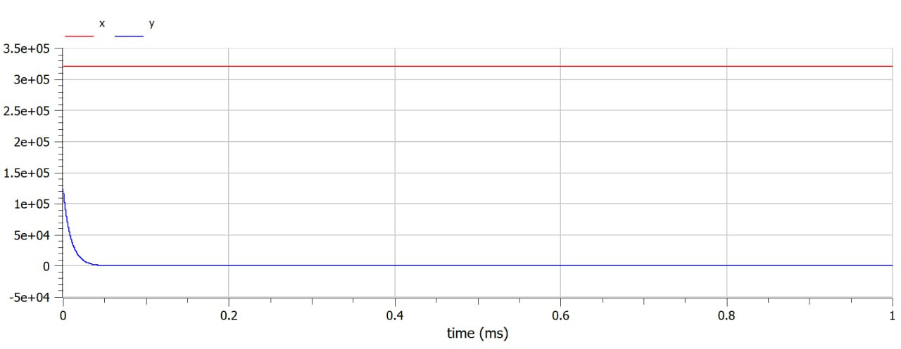

---
## Front matter
lang: ru-RU
title: Лабораторная работа №3
subtitle: Математическое моделирование 
author:
  - Мишина А. А.
date: 20 марта 2025

## i18n babel
babel-lang: russian
babel-otherlangs: english

## Formatting pdf
toc: false
toc-title: Содержание
slide_level: 2
aspectratio: 169
section-titles: true
theme: metropolis
header-includes:
 - \metroset{progressbar=frametitle,sectionpage=progressbar,numbering=fraction}
 - '\makeatletter'

 - '\makeatother'
---

## Докладчик

:::::::::::::: {.columns align=center}
::: {.column width="70%"}

  * Мишина Анастасия Алексеевна
  * НПИбд-02-22
  * <https://github.com/nasmi32>

:::
::: {.column width="30%"}


:::
::::::::::::::

## Цели и задачи

- Построить модель боевых действий на языке прогаммирования Julia и посредством ПО OpenModelica.

## Задача

Формула для выбора варианта: (1132226532 % 70) + 1 = 53 Вариант.

Между страной $X$ и страной $Y$ идет война. Численность состава войск исчисляется от начала войны, и являются временными функциями $x(t)$ и $y(t)$. В начальный момент времени страна $X$ имеет армию численностью 321000 человек, а в распоряжении страны $Y$ армия численностью в 123000 человек. Для упрощения модели считаем, что коэффициенты $a, b, c, h$ постоянны. Также считаем $P(t)$ и $Q(t)$ непрерывные функции.

## Задача

Построить графики изменения численности войск армии $X$ и армии $Y$ для  следующих случаев:

1. Модель боевых действий между регулярными войсками

$$\begin{cases}
    \dfrac{dx}{dt} = -0.336x(t)-0.877y(t)+sin(t+1)+1\\
    \dfrac{dy}{dt} = -0.441x(t)-0.232y(t)+cos(t+2)+1
\end{cases}$$

2. Модель ведение боевых действий с участием регулярных войск и партизанских отрядов

$$\begin{cases}
    \dfrac{dx}{dt} = -0.432x(t)-0.815y(t)+sin(2t)+2\\
    \dfrac{dy}{dt} = -0.336x(t)y(t)-0.245y(t)+cos(t)+2
\end{cases}$$

# Выполнение лабораторной работы

## Julia

```Julia
using DifferentialEquations, Plots
function reg(u, p, t)
	x, y = u
	a, b, c, h = p
	dx = -a*x - b*y + sin(t + 1) + 1
	dy = -c*x - h*y + cos(t + 2) + 1
	return [dx, dy]
end
u0 = [321000, 123000]
p = [0.336, 0.877, 0.441, 0.232]
tspan = (0, 1)
prob = ODEProblem(reg, u0, tspan, p)
sol = solve(prob, Tsit5())
plot(sol, title = "Модель боевых действий №1",  label = ["Армия X" "Армия Y"], xaxis = "Время", yaxis = "Численность армии")
```

## Julia

{#fig:001 width=60%}

## OpenModelica

```OpenModelica
model lab3
  parameter Real a = 0.336;
  parameter Real b = 0.877;
  parameter Real c = 0.441;
  parameter Real h = 0.232;
  parameter Real x0 = 321000;
  parameter Real y0 = 123000;
  Real x(start=x0);
  Real y(start=y0);
equation
  der(x) = -a*x - b*y + sin(t + 1) + 1;
  der(y) = -c*x - h*y + cos(t + 2) + 1;
end lab3;
```

## OpenModelica

{#fig:002 width=60%}

## Julia

```Julia
using DifferentialEquations, Plots
function reg_part(u, p, t)
	x, y = u
	a, b, c, h = p
	dx = -a*x - b*y + sin(2*t) + 2
	dy = -c*x*y - h*y + cos(t) + 2
	return [dx, dy]
end
u0 = [321000, 123000]
p = [0.432, 0.815, 0.336, 0.245]
tspan = (0, 1)
prob2 = ODEProblem(reg_part, u0, tspan, p)
sol2 = solve(prob2, Tsit5())
plot(sol2, title = "Модель боевых действий №2",  label = ["Армия X" "Армия Y"], xaxis = "Время", yaxis = "Численность армии")
```

## Julia

{#fig:003 width=60%}

## Julia

{#fig:004 width=60%}

## OpenModelica

```OpenModelica
model lab3_2
  parameter Real a = 0.432;
  parameter Real b = 0.815;
  parameter Real c = 0.336;
  parameter Real h = 0.245;
  parameter Real x0 = 321000;
  parameter Real y0 = 123000;
  Real x(start=x0);
  Real y(start=y0);
equation
  der(x) = -a*x - b*y + sin(2 * t) + 2
  der(y) = -c*x*y - h*y + cos(t) + 2
end lab3_2;
```

## OpenModelica

{#fig:005 width=60%}

## OpenModelica

{#fig:006 width=60%}

## Вывод

- В процессе выполнения данной лабораторной работы я построила модель боевых действий на языке прогаммирования Julia и посредством ПО OpenModelica, а также провела сравнительный анализ.