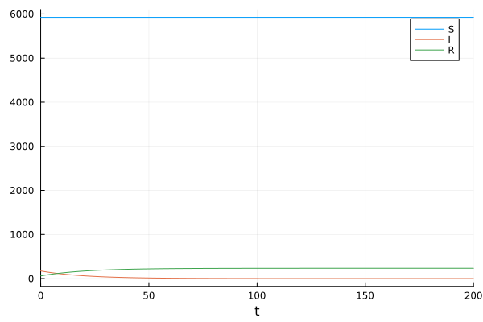
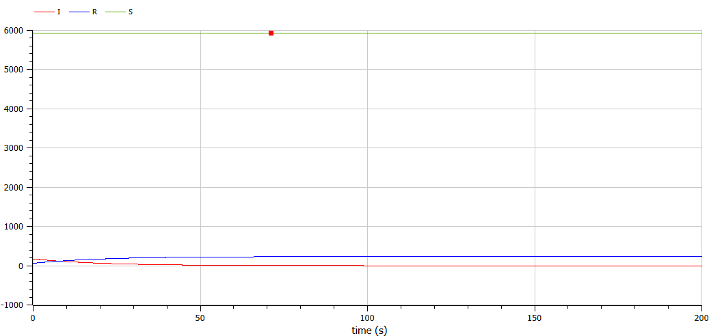
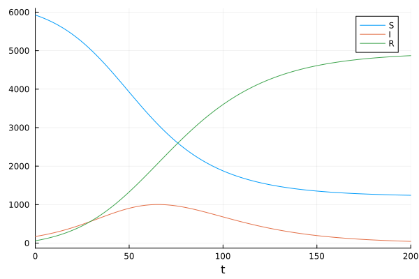
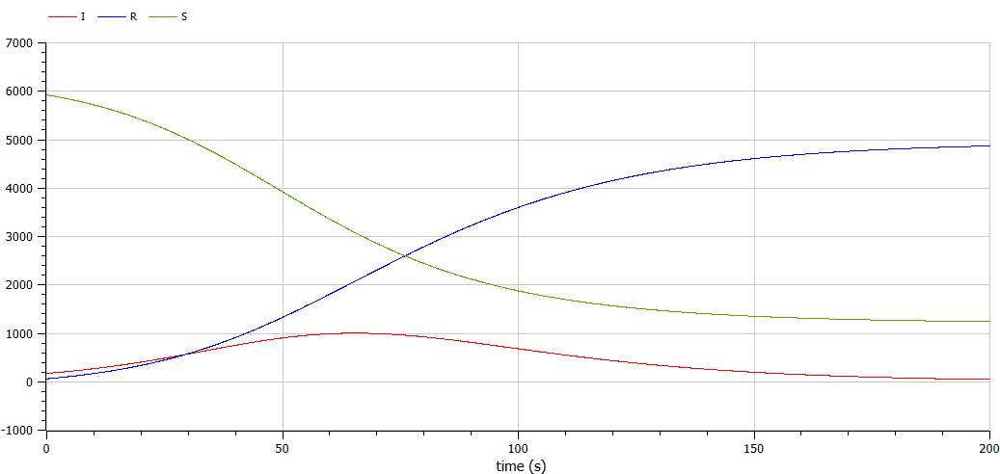

---
## Front matter
lang: ru-RU
title: Лабораторная работа №6
subtitle: Математическое моделирование
author:
  - Мишина А. А.
date: 30 апреля 2025

## i18n babel
babel-lang: russian
babel-otherlangs: english

## Formatting pdf
toc: false
toc-title: Содержание
slide_level: 2
aspectratio: 169
section-titles: true
theme: metropolis
header-includes:
 - \metroset{progressbar=frametitle,sectionpage=progressbar,numbering=fraction}
---

## Докладчик

:::::::::::::: {.columns align=center}
::: {.column width="70%"}

  * Мишина Анастасия Алексеевна
  * НПИбд-02-22
  * <https://github.com/nasmi32>

:::
::: {.column width="30%"}


:::
::::::::::::::

## Цели и задачи

- Исследовать модель SIR (задача об эпидемии).

## Задача

На одном острове вспыхнула эпидемия. Известно, что из всех проживающих на острове ($N=6159$) в момент начала эпидемии ($t=0$) число заболевших людей (являющихся распространителями инфекции) $I(0)=173$, А число здоровых людей с иммунитетом к болезни $R(0)=61$. Таким образом, число людей восприимчивых к болезни, но пока здоровых, в начальный момент времени $S(0)=N-I(0)- R(0)$.

Постройте графики изменения числа особей в каждой из трех групп.

Рассмотрите, как будет протекать эпидемия в случае:
1) если $I(0)\leq I^*$;
2) если $I(0) > I^*$.

# Выполнение лабораторной работы

# Случай $I(0)\leq I^*$

## Реализация на Julia

```Julia
function sir_2(u,p,t)
    (S,I,R) = u
    (b, c) = p
    N = S+I+R
    dS = 0
    dI = -c*I
    dR = c*I
    return [dS, dI, dR]
end
```

## Реализация на Julia

```Julia
N = 6159
I_0 = 173
R_0 = 61
S_0 = N - I_0 - R_0
u0 = [S_0, I_0, R_0]
p = [0.1, 0.05]
tspan = (0.0, 200.0)

prob_2 = ODEProblem(sir_2, u0, tspan, p)
sol_2 = solve(prob_2, Tsit5(), saveat = 0.1)
plot(sol_2, label = ["S" "I" "R"])
```

## Реализация на Julia

{#fig:001 width=70%}

## Реализация на OpenModelica

```
model lab6_1
  parameter Real I_0 = 173;
  parameter Real R_0 = 61;
  parameter Real S_0 = 5925;
  parameter Real N = 6159;
  parameter Real b = 0.1;
  parameter Real c = 0.05;  
  Real S(start=S_0);
  Real I(start=I_0);
  Real R(start=R_0);
equation
  der(S) = 0;
  der(I) = - c*I;
  der(R) = c*I;
end lab6_1;
```

## Реализация на OpenModelica

{#fig:002 width=70%}

# Случай $I(0) > I^*$

## Реализация на Julia

```Julia
function sir(u,p,t)
    (S,I,R) = u
    (b, c) = p
    N = S+I+R
    dS = -(b*S*I)/N
    dI = (b*I*S)/N - c*I
    dR = c*I
    return [dS, dI, dR]
end
```

## Реализация на Julia

```Julia
N = 6159
I_0 = 173
R_0 = 61
S_0 = N - I_0 - R_0
u0 = [S_0, I_0, R_0]
p = [0.1, 0.05]
tspan = (0.0, 200.0)

prob = ODEProblem(sir, u0, tspan, p)
sol = solve(prob, Tsit5(), saveat = 0.1)
plot(sol, label = ["S" "I" "R"])
```

## Реализация на Julia

{#fig:003 width=70%}

## Реализация на OpenModelica

```
model lab6_2
  parameter Real I_0 = 173;
  parameter Real R_0 = 61;
  parameter Real S_0 = 5925;
  parameter Real N = 6159;
  parameter Real b = 0.1;
  parameter Real c = 0.05;  
  Real S(start=S_0);
  Real I(start=I_0);
  Real R(start=R_0);
equation
  der(S) = -(b*S*I)/N;
  der(I) = (b*I*S)/N - c*I;
  der(R) = c*I;
end lab6_2;
```

## Реализация на OpenModelica

{#fig:004 width=70%}

## Выводы

- В результате выполнения данной лабораторной работы я исследовала модель SIR.