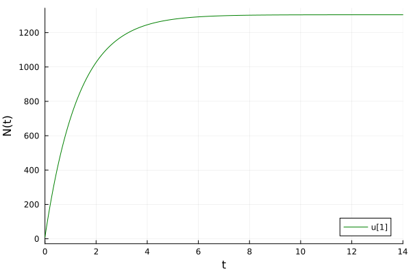
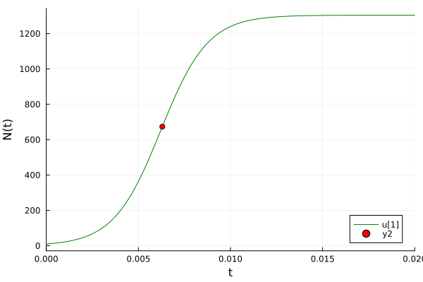
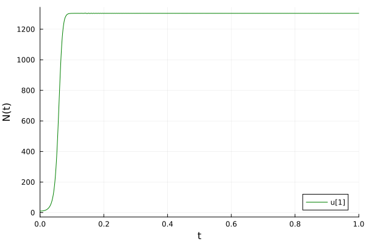
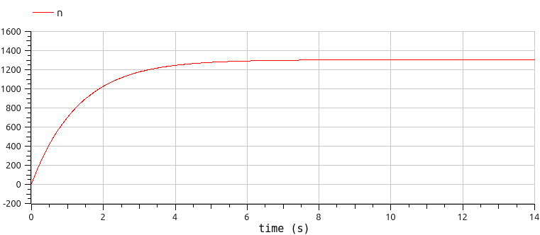
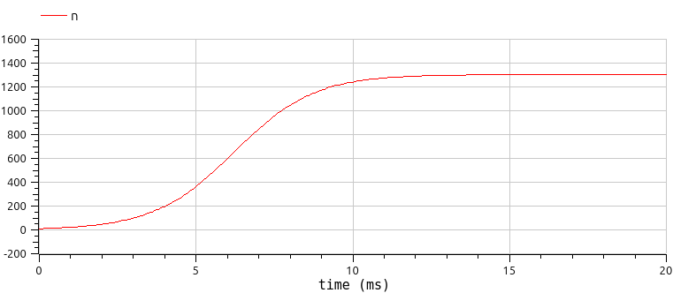
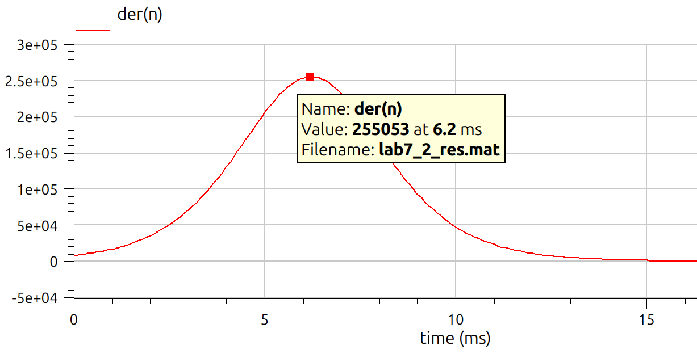
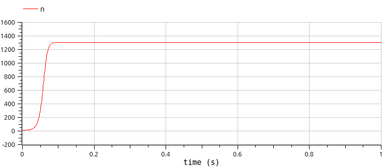

---
## Front matter
lang: ru-RU
title: Лабораторная работа №7
subtitle: Математическое моделирование
author:
  - Мишина А. А.
date: 12 мая 2025

## i18n babel
babel-lang: russian
babel-otherlangs: english

## Formatting pdf
toc: false
toc-title: Содержание
slide_level: 2
aspectratio: 169
section-titles: true
theme: metropolis
header-includes:
 - \metroset{progressbar=frametitle,sectionpage=progressbar,numbering=fraction}
---

## Докладчик

:::::::::::::: {.columns align=center}
::: {.column width="70%"}

  * Мишина Анастасия Алексеевна
  * НПИбд-02-22
  * <https://github.com/nasmi32>

:::
::: {.column width="30%"}


:::
::::::::::::::

## Цели и задачи

- Исследовать модель эффективности рекламы. 

## Задача

Построить график распространения рекламы, математическая модель которой описывается следующим уравнением:

1. $\dfrac{dn}{dt} = (0.76+0.000016n(t))(N-n(t))$

2. $\dfrac{dn}{dt} = (0.000016+0.6n(t))(N-n(t))$

3. $\dfrac{dn}{dt} = (0.7sin(7t)+0.7sin(3t)n(t))(N-n(t))$

При этом объем аудитории $N = 1304$, в начальный момент о товаре знает 10 человек. Для случая 2 определить в какой момент времени скорость распространения рекламы будет иметь максимальное значение.

# Выполнение лабораторной работы

# Реализация на Julia

## Реализация на Julia: Случай 1 и 2

```Julia
using DifferentialEquations, Plots;
f(n, p, t) = (p[1] + p[2]*n)*(p[3] - n)
p1 = [0.76, 0.000016, 1304]
p2 = [0.000016, 0.6, 1304]
n_0 = 10
tspan1 = (0.0, 14.0)
tspan2 = (0.0, 0.02)
prob1 = ODEProblem(f, n_0, tspan1, p1)
prob2 = ODEProblem(f, n_0, tspan2, p2)
```

## Реализация на Julia: Случай 1

```Julia
sol1 = solve(prob1, Tsit5(), saveat = 0.01)
plot(sol1, markersize =:15, c =:green, yaxis = "N(t)")
```

## Реализация на Julia: Случай 1

{#fig:001 width=70%}

## Реализация на Julia: Случай 2

```Julia
sol2 = solve(prob2, Tsit5(), saveat = 0.0001)
plot(sol2, markersize =:15, c=:green, yaxis="N(t)")
```

## Реализация на Julia: Случай 2

```Julia
dev = [sol2(i, Val{1}) for i in 0:0.0001:0.02]
maximum(dev)
```

- Получим значение `254968.21279632105`.

```Julia
findall(x -> x == 254968.21279632105, dev)

1-element Vector{Int64}:
 64
```

## Реализация на Julia: Случай 2

```Julia
x = sol2.t[64]
y = sol2.u[64]
scatter!((x,y), c=:red, leg=:bottomright)
```

## Реализация на Julia: Случай 2

{#fig:002 width=70%}

## Реализация на Julia: Случай 3

```Julia
function f3(u,p,t)
    n = u
    dn = (0.7*sin(7*t) + 0.7*sin(3*t)*n)*(1304 - n)
end
u_0 = 10
tspan = (0.0, 1)
prob = ODEProblem(f3, u_0, tspan)
sol = DifferentialEquations.solve(prob, Tsit5(), saveat = 0.001)
plot(sol, markersize =:15, c=:green, yaxis="N(t)")
```

## Реализация на Julia: Случай 3

{#fig:003 width=70%}

# Реализация на OpenModelica

## Реализация на OpenModelica: Случай 1

```
model lab7_1
  parameter Real a_1 = 0.76;
  parameter Real a_2 = 0.000016;
  parameter Real N = 1304;
  parameter Real n_0 = 10;
  
  Real n(start=n_0);

equation
  der(n) = (a_1 + a_2*n)*(N - n);
end lab7_1;
```

## Реализация на OpenModelica: Случай 1

{#fig:004 width=70%}

## Реализация на OpenModelica: Случай 2

```
model lab7_2
  parameter Real a_1 = 0.000016;
  parameter Real a_2 = 0.6;
  parameter Real N = 1304;
  parameter Real n_0 = 10;
  
  Real n(start=n_0);

equation
  der(n) = (a_1 + a_2*n)*(N - n);
end lab7_2;
```

## Реализация на OpenModelica: Случай 2

{#fig:005 width=70%}

## Реализация на OpenModelica: Случай 2

{#fig:006 width=70%}

## Реализация на OpenModelica: Случай 3

```
model lab7_3
  parameter Real a_1 = 0.7;
  parameter Real a_2 = 0.7;
  parameter Real N = 1304;
  parameter Real n_0 = 10;
  
  Real n(start=n_0);

equation
  der(n) = (a_1*sin(7*time) + a_2*sin(3*time)*n)*(N - n);
end lab7_3;
```

## Реализация на OpenModelica: Случай 3

{#fig:007 width=70%}

## Выводы

- В результате выполнения данной лабораторной работы была исследована модель эффективности рекламы.
