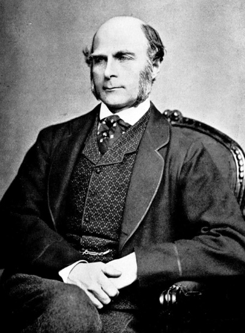

---
## Front matter
lang: ru-RU
title: Доклад
subtitle: Теорема о прогнозе разнообразия
author:
  - Мишина А. А.
date: 01 мая 2025

## i18n babel
babel-lang: russian
babel-otherlangs: english

## Formatting pdf
toc: false
toc-title: Содержание
slide_level: 2
aspectratio: 169
section-titles: true
theme: metropolis
header-includes:
 - \metroset{progressbar=frametitle,sectionpage=progressbar,numbering=fraction}
 - '\makeatletter'
 - '\beamer@ignorenonframefalse'
 - '\makeatother'
---

# Информация

## Докладчик

:::::::::::::: {.columns align=center}
::: {.column width="70%"}

  * Мишина Анастасия Алексеевна
  * Группа: НПИбд-02-22
  * Российский университет дружбы народов
  * [1132226532@pfur.ru](mailto:1132226532@pfur.ru)
  * <https://github.com/nasmi32>

:::
::: {.column width="25%"}

:::
::::::::::::::

# Вводная часть

## Цели и задачи

**Цель**

Изучить теорему о прогнозе разнообразия.

**Задачи**

* Описать понятие "мудрость толпы";
* Дать теоретическое описание теоремы о прогнозе разнообразия;
* Показать работу теоремы на примере;
* Выполнить практическую часть на языке программирования Julia. 

## Актуальность

Теорема о прогнозе разнообразия предполагает, что средний прогноз от совокупности прогнозов будет точнее к реальным показателям, чем отдельный прогноз (эффект «мудрости толпы»).

## Эксперимент Гальтона

:::::::::::::: {.columns align=center}
::: {.column width="70%"}

- 800 человек угадали вес быка с точностью до 0.08%
- Коллективная оценка точнее экспертной

- Доказательство "мудрости толпы"

:::
::: {.column width="25%"}

{width=70%}

:::
::::::::::::::

## Мудрость толпы

: Четыре элемента, необходимые для формирования мудрой толпы

| Критерии	                    |   Описание                                                                                                           |
|-------------------------------|----------------------------------------------------------------------------------------------------------------------|
| Разнообразие мнений           |  Каждый участник должен обладать уникальной информацией, даже если это лишь нестандартная интерпретация известных фактов. |
| Независимость                 |  Мнения людей не определяются точкой зрения окружающих.                                                              |
| Децентрализация	              |  Люди могут специализироваться и использовать локальные знания.                                                      |
| Агрегация	                    |  Существует механизм преобразования индивидуальных оценок в коллективное решение.                                    |

## Теорема о прогнозе разнообразия

Коллективная ошибка = Средняя индивидуальная ошибка - Разнообразие прогнозирования

$$(c - \theta)^2 = \frac{1}{n} \sum_{i = 1}^n (s_i - \theta)^2 - \frac{1}{n} \sum_{i = 1}^n (s_i - c)^2$$

* $c$ — предсказание толпы (общая оценка параметра).
* $\theta$ — истинное значение параметра.
* $s_i$ — индивидуальные оценки параметра.

## Теоретическое применение теоремы

Два человека предсказывают, сколько "Оскаров" получит конкретный фильм. Реальное число "Оскаров":

$$\mathrm{true} \, \, \, \mathrm{value} = 4$$

## Теоретическое применение теоремы

: Результаты предсказаний людей

| Человек | Предсказание |
|---------|--------------|
|  Настя  |      2       |
|  Ира    |      8       |


$$\mathrm{average} \, \, \, \mathrm{value} = \dfrac{2+8}{2} = 5$$ 

## Теоретическое применение теоремы

: Квадратичная ошибка каждого человека

| Человек |  Ошибка         |
|---------|-----------------|
| Настя   | $(4-2)^2= 4$    |
| Ира     | $(4-8)^2= 16$   |

$$\mathrm{average} \, \, \, \mathrm{error} = \dfrac{4+16}{2} = 10$$

## Теоретическое применение теоремы

$$\mathrm{crowd's} \, \, \, \mathrm{error} = (4-5)^2 = 1$$

## Теоретическое применение теоремы

: Отдаленность предсказания каждого человека от среднего прогноза

| Человек | Разнообразие   |
|---------|----------------|
| Настя   | $(5-2)^2= 9$   |
| Ира     | $(5-8)^2= 9$   |
 
$$\mathrm{diversity} = \dfrac{9+9}{2} = 9$$

## Теоретическое применение теоремы

$$1 = 10 - 9,$$

то есть

$$\mathrm{Crowd's} \, \, \, \mathrm{error} = \mathrm{Average} \, \, \, \mathrm{error} - \mathrm{Diversity}$$

Таким образом, мы пришли к теореме о прогнозе разнообразия (Diversity Prediction Theorem):

$$(c - \theta)^2 = \frac{1}{n} \sum_{i = 1}^n (s_i - \theta)^2 - \frac{1}{n} \sum_{i = 1}^n (s_i - c)^2$$

## Практическое применение теоремы

## Функция diversitytheorem

```Julia
function diversitytheorem(truth::T, pred::Vector{T}) where T<:Number
    μ = mean(pred)
    avgerr = mean((pred .- truth) .^ 2)
    crderr = (μ - truth) ^ 2
    divers = mean((pred .- μ) .^ 2)
    avgerr, crderr, divers
end
for (t, s) in [(4, [2, 8])]
    avgerr, crderr, divers = diversitytheorem(t, s)
    println("""
    average-error : $avgerr
    crowd-error   : $crderr
    diversity     : $divers
    """)
end
```

## Результат выполнения функции

```
average-error : 10.0
crowd-error   : 1.0
diversity     : 9.0
```

# Выводы

- "Мудрость толпы" работает лишь при истинном разнообразии мнений.
Общие ошибки всех участников искажают средний результат.