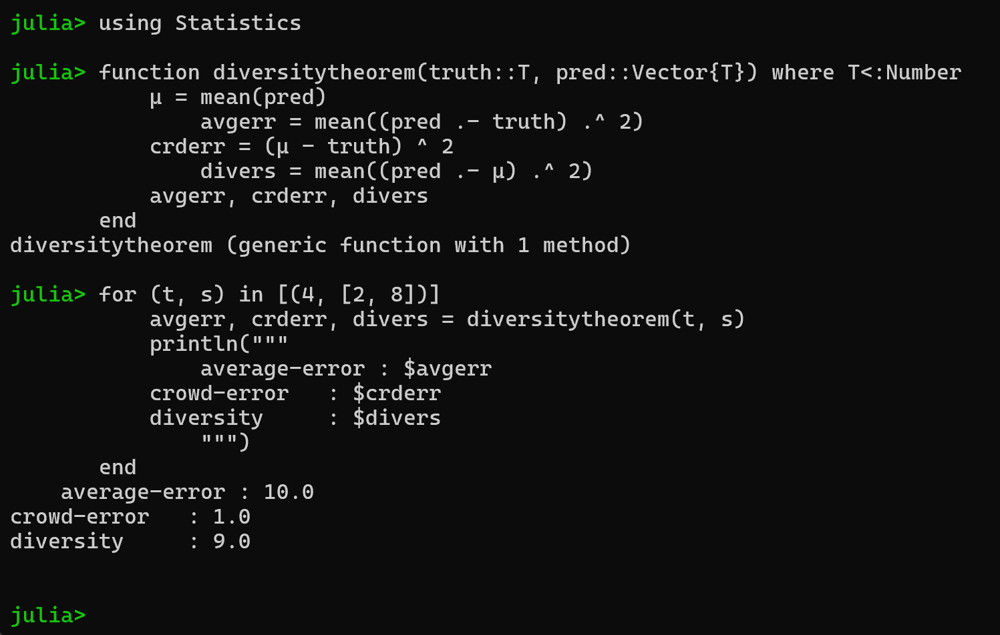

---
## Front matter
title: "Доклад на тему: Теорема о прогнозе разнообразия"
subtitle: "Дисциплина: Математическое моделирование"
author: "Мишина Анастасия Алексеевна"

## Generic otions
lang: ru-RU
toc-title: "Содержание"

## Bibliography
bibliography: bib/cite.bib
csl: pandoc/csl/gost-r-7-0-5-2008-numeric.csl

## Pdf output format
toc: true # Table of contents
toc-depth: 2
lof: true # List of figures
lot: true # List of tables
fontsize: 12pt
linestretch: 1.5
papersize: a4
documentclass: scrreprt
## I18n polyglossia
polyglossia-lang:
  name: russian
  options:
	- spelling=modern
	- babelshorthands=true
polyglossia-otherlangs:
  name: english
## I18n babel
babel-lang: russian
babel-otherlangs: english
## Fonts
mainfont: IBM Plex Serif
romanfont: IBM Plex Serif
sansfont: IBM Plex Sans
monofont: IBM Plex Mono
mathfont: STIX Two Math
mainfontoptions: Ligatures=Common,Ligatures=TeX,Scale=0.94
romanfontoptions: Ligatures=Common,Ligatures=TeX,Scale=0.94
sansfontoptions: Ligatures=Common,Ligatures=TeX,Scale=MatchLowercase,Scale=0.94
monofontoptions: Scale=MatchLowercase,Scale=0.94,FakeStretch=0.9
mathfontoptions:
## Biblatex
biblatex: true
biblio-style: "gost-numeric"
biblatexoptions:
  - parentracker=true
  - backend=biber
  - hyperref=auto
  - language=auto
  - autolang=other*
  - citestyle=gost-numeric
## Pandoc-crossref LaTeX customization
figureTitle: "Рис."
tableTitle: "Таблица"
listingTitle: "Листинг"
lofTitle: "Список иллюстраций"
lotTitle: "Список таблиц"
lolTitle: "Листинги"
## Misc options
indent: true
header-includes:
  - \usepackage{indentfirst}
  - \usepackage{float} # keep figures where there are in the text
  - \floatplacement{figure}{H} # keep figures where there are in the text
---

# Введение

**Цель**

Изучить теорему о прогнозе разнообразия.

**Задачи**

* Описать понятие "мудрость толпы";
* Дать теоретическое описание теоремы о прогнозе разнообразия;
* Показать работу теоремы на примере;
* Выполнить практическую часть на языке программирования Julia. 

**Актуальность**

При формировании численных прогнозов, особенно в таких областях, как прогнозирование роста продаж, бюджетное планирование или анализ рыночных тенденций, целесообразно интегрировать множественные оценки. Научные исследования свидетельствуют о том, что совокупное мнение группы зачастую нивелирует индивидуальные погрешности и превосходит по точности оценки отдельных экспертов.

Теорема о прогнозе разнообразия предполагает, что средний прогноз от совокупности прогнозов будет точнее к реальным показателям, чем отдельный прогноз (эффект «мудрости толпы»). Слишком оптимистичные и слишком пессимистичные прогнозы взаимно уравновешиваются. Это происходит благодаря двум ключевым факторам:

1. **Баланс переоценок и недооценок** – ошибки отдельных участников компенсируют друг друга.
2. **Разнообразие мнений** – разные подходы и источники информации снижают систематические искажения.

Практическое применение:

1. Финансы и инвестиции: прогнозирование курсов акций, брокерские компании объединяют прогнозы нескольких аналитиков, оценка рисков, страховые компании используют ансамбли моделей для расчета вероятностей страховых случаев.
2. Машинное обучение: ансамблевые методы (Random Forest: объединяет прогнозы сотен деревьев решений или градиентный бустинг: последовательная коррекция ошибок множества моделей).
3. Политика и социология: предвыборные опросы.
4. Метеорология: прогноз погоды.
5. Управление проектами: оценка сроков, техника "планирования покера" (planning poker) в Agile основаны на агрегации независимых оценок команды.

Теорема о прогнозе разнообразия применима к моделям, которые делают численные прогнозы или оценки. Она количественно оценивает влияние точности моделей и их разнообразия на точность их среднего [@model_thinker].

# Эксперимент Гальтона

В 1906 г. в городе Плимут (Великобритания) на сельской ярмарке был проведен эксперимент. Френсис Гальтон в качестве развлечения посетителей ярмарки предложил на глаз оценить вес выставленного на всеобщее обозрение быка и написать эту цифру на специальном билете. За правильные ответы организаторы шоу обещали призы. В результате в голосовании приняли участие около 800 человек — как заядлых фермеров, так и людей, далеких от скотоводческих дел. Собрав после этой ярмарки все билеты для анализа, Гальтон высчитал среднее арифметическое значение для всей выборки — 1197 фунтов. Реальный же вес быка оказался 1198 фунтов (543,4 кг). Каким-то непостижимым образом разношерстная публика дала ответ, максимально приближенный к реальному показателю. Т.е. ответ публики был точнее чем ответ отдельно взятого эксперта, например мясника или скотовода. Гальтон, который до этого свято верил в селекцию и превосходство одних людей над другими, был вынужден сменить вектор своих исследований.

С тех пор Френсис Гальтон изменил своё мнение по поводу мудрости толпы, он сказал:

> "Результат кажется более достойным доверия к демократическому суждению, чем можно было ожидать."

# Мудрость толпы

Аристотель считается первым человеком, написавшим о «мудрости толпы» в своей работе «Политика». Согласно Аристотелю, «возможно, что многие, хотя и не индивидуально хорошие люди, но когда они собираются вместе, могут быть лучше, не индивидуально, а коллективно, чем те, кто таков, точно так же, как публичные обеды, в которые многие вносят свой вклад, лучше, чем те, которые предоставляются за счет одного человека».

Опубликованная в 2004 году книга Джеймса Суровецки исследует, как объединение информации в группах приводит к решениям, которые зачастую оказываются лучше, чем решения, принимаемые отдельными членами группы. В книге представлены многочисленные кейсы и примеры, иллюстрирующие эту идею, с акцентом на экономику и психологию [@wiki_wisdom]. Её центральный тезис — разнородная группа независимых участников часто принимает более точные решения и прогнозы, чем отдельные люди или даже эксперты.

Во введении описывается удивление Фрэнсиса Гальтона, обнаружившего, что средняя оценка веса быка, данная посетителями сельской ярмарки, оказалась точнее большинства индивидуальных предположений (медианное значение было ближе к реальному весу быка, чем оценки большинства участников) [@wisdom_crowd].

Для формирования мудрой толпы требуются четыре элемента.

Не все толпы (группы) являются мудрыми. Например, рассмотрим агрессивную толпу или охваченных ажиотажем инвесторов во время биржевого пузыря. Согласно Суровецки, следующие ключевые критерии отличают мудрые толпы от иррациональных (см. в табл. [-@tbl:wis]):

: Четыре элемента, необходимые для формирования мудрой толпы {#tbl:wis}

| Критерии	                    |   Описание                                                                                                           |
|-------------------------------|----------------------------------------------------------------------------------------------------------------------|
| Разнообразие мнений           |  Каждый участник должен обладать уникальной информацией, даже если это лишь нестандартная интерпретация известных фактов. |
| Независимость                 |  Мнения людей не определяются точкой зрения окружающих.                                                              |
| Децентрализация	              |  Люди могут специализироваться и использовать локальные знания.                                                      |
| Агрегация	                    |  Существует механизм преобразования индивидуальных оценок в коллективное решение.                                    |

# Теорема о прогнозе разнообразия

Скотт Э. Пейдж - американский социолог и заслуженный профессор Университета Джона Сили Брауна в области сложности, социальных наук и менеджмента в Мичиганском университете в Энн-Арборе. Он представил теорему прогнозирования разнообразия:

Квадрат ошибки коллективного прогнозирования = средний квадрат ошибки - прогнозируемое разнообразие.

Следовательно, когда разнообразие в группе велико, ошибка толпы невелика.

*Определения*

* Средняя индивидуальная ошибка: среднее значение индивидуальных квадратов ошибок
* Коллективная ошибка: квадратическая ошибка коллективного прогнозирования
* Разнообразие прогнозов: среднее квадратическое расстояние от индивидуальных прогнозов до коллективного прогноза

Теорема прогнозирования разнообразия: Учитывая множество прогностических моделей, имеем
 
Коллективная ошибка = Средняя индивидуальная ошибка - Разнообразие прогнозирования

$$(c - \theta)^2 = \frac{1}{n} \sum_{i = 1}^n (s_i - \theta)^2 - \frac{1}{n} \sum_{i = 1}^n (s_i - c)^2$$

* $c$ — предсказание толпы (общая оценка параметра).
* $\theta$ — истинное значение параметра.
* $s_i$ — индивидуальные оценки параметра.

## Теоретическое применение теоремы

Рассмотрим применение теоремы на примере прогнозирования количества наград "Оскар", которые получит конкретный фильм.

Допустим у нас есть двое людей (Настя и Ира), которые предсказывают, сколько "Оскаров" получит конкретный фильм (см. в табл. [-@tbl:pred]). 

Реальное число "Оскаров":

$$\mathrm{true} \, \, \, \mathrm{value} = 4$$

: Результаты предсказаний людей {#tbl:pred}

| Человек | Предсказание |
|---------|--------------|
|  Настя  |      2       |
|  Ира    |      8       |

Чтобы получить среднюю оценку предсказаний, надо их сложить и поделить на количество:

$$\mathrm{average} \, \, \, \mathrm{value} = \dfrac{2+8}{2} = 5$$ 

Теперь давайте вычислим квадратичную ошибку каждого человека (см. в табл. [-@tbl:error]):

: Квадратичная ошибка каждого человека {#tbl:error}

| Человек |  Ошибка         |
|---------|-----------------|
| Настя   | $(4-2)^2= 4$    |
| Ира     | $(4-8)^2= 16$   |

Тогда средняя ошибка каждого человека составляет:

$$\mathrm{average} \, \, \, \mathrm{error} = \dfrac{4+16}{2} = 10$$

Давайте посмотрим, насколько точной была оценка толпы, посчитав ее ошибку:

$$\mathrm{crowd's} \, \, \, \mathrm{error} = (4-5)^2 = 1$$

То есть толпа ошиблась всего на 1. Таким образом, мы получаем мудрость толпы.

Чтобы понять, почему это имеет смысл, рассмотрим разнообразие (вариации в предсказаниях). Мы посмотрим на предсказание каждого человека и его отдаленность от среднего прогноза (см. в табл. [-@tbl:diversity]). 

: Отдаленность предсказания каждого человека от среднего прогноза {#tbl:diversity}

| Человек | Разнообразие   |
|---------|----------------|
| Настя   | $(5-2)^2= 9$   |
| Ира     | $(5-8)^2= 9$   |
 
Тогда разнообразие предсказаний составляет:

$$\mathrm{diversity} = \dfrac{9+9}{2} = 9$$
   
Получается, что

$$1 = 10 - 9,$$

то есть

$$\mathrm{Crowd's} \, \, \, \mathrm{error} = \mathrm{Average} \, \, \, \mathrm{error} - \mathrm{Diversity}$$

Таким образом, мы пришли к теореме о прогнозе разнообразия (Diversity Prediction Theorem):

$$(c - \theta)^2 = \frac{1}{n} \sum_{i = 1}^n (s_i - \theta)^2 - \frac{1}{n} \sum_{i = 1}^n (s_i - c)^2$$

## Практическое применение теоремы

Для практической части воспользуемся языком программирования Julia. Julia — высокоуровневый свободный язык программирования с динамической типизацией, созданный для математических вычислений. Будем использовать пакет `Statistics`, который содержит базовые функции статистики. В нем есть функция `mean()`, которая нужна для вычисления среднего значения для всех элементов в коллекции.

Функция для вычисления элементов теоремы о прогнозе разнообразия (средняя индивидуальная ошибка, коллективная ошибка, разнообразие прогнозов) будет выглядеть следующим образом:

```Julia
function diversitytheorem(truth::T, pred::Vector{T}) where T<:Number
    mu = mean(pred)
    avgerr = mean((pred .- truth) .^ 2)
    crderr = (mu - truth) ^ 2
    divers = mean((pred .- mu) .^ 2)
    avgerr, crderr, divers
end

for (t, s) in [(4, [2, 8])]
    avgerr, crderr, divers = diversitytheorem(t, s)
    println("""
    average-error : $avgerr
    crowd-error   : $crderr
    diversity     : $divers
    """)
end
```

В результате получаем (рис. [-@fig:001]):

```
average-error : 10.0
crowd-error   : 1.0
diversity     : 9.0
```

{#fig:001 width=100%}

# Выводы

Из теоремы о прогнозе разнообразия не следует, что совокупность различных моделей обеспечивает точную картину. Если всем моделям свойственна общая систематическая ошибка, то и среднее тоже будет ее содержать.

Феномен "мудрость толпы" объясняет эффективность ансамблевых методов в информатике, которые выводят среднее множества классификаций, а также то, что люди, использующие в рассуждениях множество моделей и концептуальных схем, делают более точные прогнозы по сравнению с теми, кто ориентируется лишь на отдельные модели. Любой однобокий взгляд на мир упускает важные детали и оставляет белые пятна.

Теорема о прогнозе разнообразия подразумевает, что формирование разнопланового множества умеренно точных моделей прогнозирования позволило бы нам свести погрешность множества моделей практически к нулю.

# Список литературы{.unnumbered}

::: {#refs}
:::
